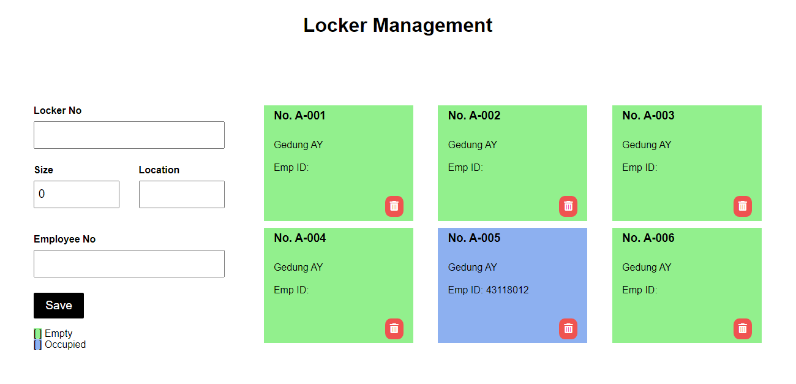

# Locker Management

A simple practice project that uses .NET Core and Angular in its creation.





## Features

- Create, Read (show card like a dashoard), Update (bug), Delete
- Swagger (API Documentation)
- Live previews
- Colored indicator (automatically based on whether or not there is an employee id)


## Run Locally

Clone the project

```bash
  git clone https://github.com/oneagustiranda/LockerManagement.git
```

Go to the project directory

```bash
  cd LockerManagement
```

Go to API directory for running back-end logical

```bash
  cd API/Locker
```

Go to UI directory for running front-end

```bash
  cd UI/locker
```

## Form Input

In the form, there are several inputs such as:
- Locker No (string - Can accept any locker numbering format)
- Size (int - Locker size can only be entered with numbers such as size 0, 1, 2, etc)
- Location (string - This location is where this locker is if it has many buildings)
- Employee No (string - Contains a unique employee number, and each employee can only have one locker)

## Limitation

Update the locker data by clicking on the locker number, then changing the data in the same form as adding data to the locker. The data locker still can't be replaced, due to a problem with the route.


## Acknowledgements

 - [.NET Core documentation](https://learn.microsoft.com/en-us/aspnet/core/tutorials/min-web-api?view=aspnetcore-6.0&tabs=visual-studio-code)
 - [Angular documentation](https://angular.io/start/start-deployment#running-your-application-locally)
 